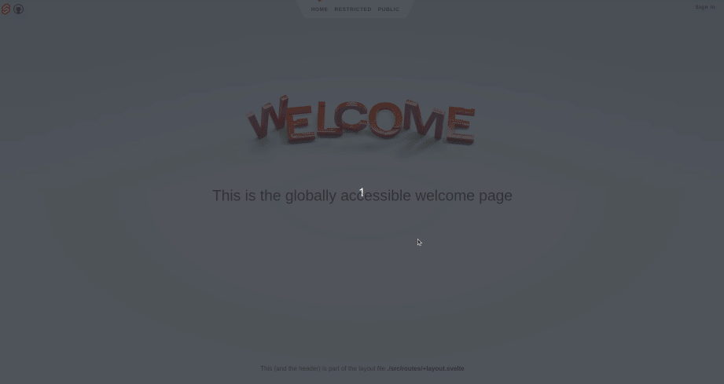

# source guides

- [Svelte](https://kit.svelte.dev/docs/creating-a-project)

## Svelte setup

### Creating a Svelte project

The easiest way to start building a SvelteKit app is to run npm create:

```bash
# create a new project in a new 'my-app' directory
npm create svelte@latest my-app
cd my-app
npm install
```

NOTE: For this project I used the Svelte Demo App with Typescript as a template.

Once you've created a project and installed dependencies with `npm install` (or `pnpm install` or `yarn`), start a development server:

```bash
npm run dev
```

### First steps

There are two basic concepts:

Each page of your app is a Svelte component

- You create pages by adding files to the src/routes directory of your project. These will be server-rendered so that a user's first visit to your app is as - fast as possible, then a client-side app takes over

Try editing the files to get a feel for how everything works.

### Building

To create a production version of your app:

```bash
npm run build
```

You can preview the production build with `npm run preview`.

> To deploy your app, you may need to install an [adapter](https://kit.svelte.dev/docs/adapters) for your target environment.

## SvelteKit Auth setup

[SvelteKit Auth](https://authjs.dev/reference/sveltekit)

SvelteKit Auth is the official SvelteKit integration for Auth.js. It provides a simple way to add authentication to your SvelteKit app in a few lines of code.

### Installation

```bash
# npm
npm install @auth/core @auth/sveltekit

# yarn
yarn add @auth/core @auth/sveltekit

# pnpm
pnpm add @auth/core @auth/sveltekit
```

### Setup

Next, we need to configure the authentication providers we want to use. Create a new file in the src directory called hooks.server.ts and add the following code:

> NOTE: We will use Google for the authentification because Cognito authentication is not solved yet

```bash
# src/hooks.server.ts
import { SvelteKitAuth } from '@auth/sveltekit';
import Google from '@auth/core/providers/google';

import type { OAuthConfig } from '@auth/core/providers/index.js';
import type { Profile } from '@auth/core/types.js';

import { GOOGLE_ID, GOOGLE_SECRET } from '$env/static/private';

export const handle = SvelteKitAuth({
	providers: [
		Google({
			clientId: GOOGLE_ID,
			clientSecret: GOOGLE_SECRET
		}) as OAuthConfig<Profile>
	]
});
```

Don't forget to set the AUTH_SECRET environment variable. This should be a minimum of 32 characters, random string. On UNIX systems you can use openssl rand -hex 32 or check out https://generate-secret.vercel.app/32.

> NOTE: When deploying your app outside Vercel, set the AUTH_TRUST_HOST variable to true for other hosting providers like Cloudflare Pages or Netlify.

```bash
# ~/.env
GOOGLE_ID=XXXXXXXXXXX
GOOGLE_SECRET=XXXXXXXXXX

AUTH_SECRET=XXXXXXXXXXX

```

The callback URL used by the providers must be set to the following, unless you override prefix:

```bash
[origin]/auth/callback/[provider]
```

# Signing in and signing out

The data for the current session in this example was made available through the $page store which can be set through the root +page.server.ts file. It is not necessary to store the data there, however, this makes it globally accessible throughout your application simplifying state management.

```bash
# ~/src/routes/LoginButton.svelte
<script>
    import { signIn, signOut } from "@auth/sveltekit/client"
    import { page } from "$app/stores"
</script>

<div>
    {#if $page.data.session}
    <h2>{$page.data.session.user?.email}</h2>
    <h2 on:click={() => signOut()}>Sign out</h2>
    {:else}
    <h2 on:click={() => signIn()}>Sign in</h2>
    {/if}
</div>
```

The above example checks for a session available in $page.data.session, however that needs to be set by us somewhere. If you want this data to be available to all your routes you can add this to src/routes/+layout.server.ts. The following code sets the session data in the $page store to be available to all routes.

```bash
# ~/src/routes/+layout.server.ts
import type { LayoutServerLoad } from './$types';

export const load: LayoutServerLoad = async (event) => {
  return {
    session: await event.locals.getSession()
  };
};
```


